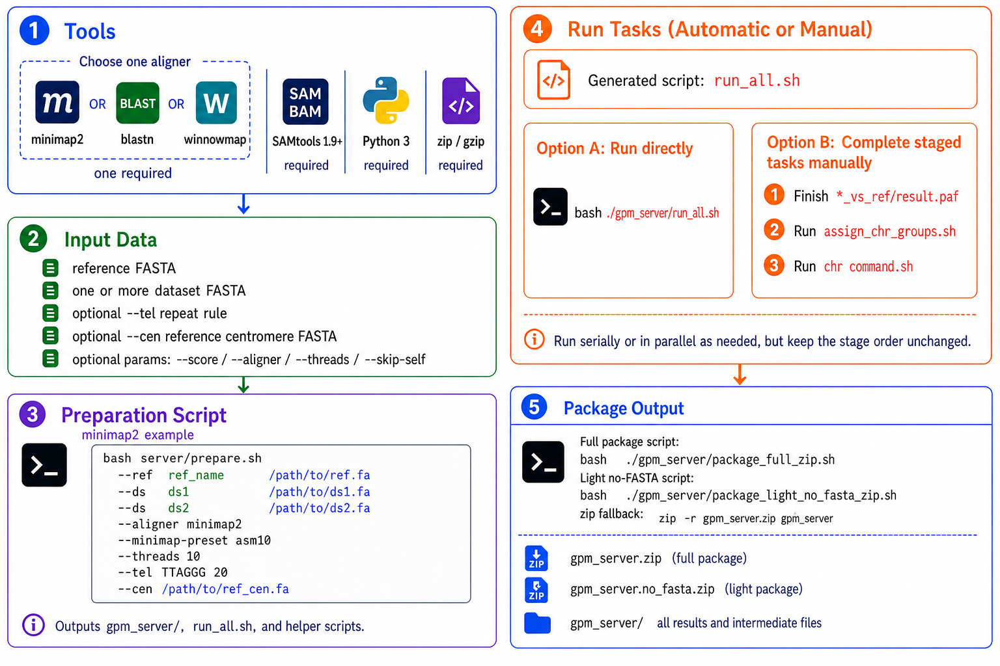

# GPM Next

**English** | [中文](README_zh.md)

GPM Next is a visual assembly tool anchored to a reference genome and designed to integrate the strengths of multiple de novo assembly approaches. It brings outputs from different assembly tools into one unified workflow for import, inspection, and lightweight editing.

## Architecture

GPM Next uses a split architecture between the server side and the client side:

- The server side runs alignment commands and generates the delivery zip package in a Linux environment. Upload the `server/` directory to the server before running the workflow.
- The client side imports the server-generated delivery package and provides visualization and lightweight editing. Users can download the platform-specific installer from GitHub Releases; currently supported builds are `win-x86`, `win-arm64`, `mac-x86`, and `mac-arm64`.

## Server-Side Workflow



### Prerequisites

- Required tools: `SAMtools 1.9+`, `Python 3`, `zip`, `gzip`
- Alignment tools by engine:
  - `minimap2`: recommended `2.31`; older versions that support `-x asm10/asm5`, `-t`, and PAF output remain usable
  - `blastn`: recommended BLAST+ `2.17.0`, with `makeblastdb`
  - `winnowmap`: recommended `2.03`, with `meryl`
- Input data: `ref_genome.fa`, `hifiasm.fa`, `flye.fa`, `canu2.fa`

Note: This document uses these data only as an example to illustrate the workflow. The workflow is not limited to this specific kind of input.

### Run the server preparation script

```bash
bash server/prepare.sh \
  --ref rice_IRGSP_1_0 /path/to/ref.fa \
  --ds hifiasm /path/to/hifi.fa \
  --ds flye /path/to/flye.fa \
  --ds canu2 /path/to/canu2.fa \
  [-o|--out /path/to/gpm_server] \
  [-s|--score 60] \
  [--aligner minimap2|blastn|winnowmap] \
  # minimap2-specific option; only valid with --aligner minimap2
  [--minimap-preset asm10|asm5] \
  # blastn-specific options; only valid with --aligner blastn
  [--blastn-task blastn|megablast|dc-megablast] \
  [--blastn-evalue 1e-10] \
  # winnowmap-specific options; only valid with --aligner winnowmap
  [--winnowmap-preset asm20|asm10|asm5] \
  [--winnowmap-kmer 19] \
  [--winnowmap-repeat-fraction 0.9998] \
  [-t|--threads 10] \
  [--tel TTAGGG 20] \
  [--cen /path/to/ref_cen.fa] \
  [--cen-min-len 10000] \
  [--cen-min-identity 80] \
  [--skip-self]
```

Bracketed arguments are optional.

**Common options:**

- `-o/--out`: choose the output directory; default is `./gpm_server` under the current working directory
- `-s/--score`: chr assignment threshold, default `60`
- `--aligner`: choose `minimap2`, `blastn`, or `winnowmap`; default `minimap2`
- `-t/--threads`: alignment worker threads for generated commands, default `10`
- `--tel <motif> <min_repeat>`: repeatable telomere-like tandem-repeat scan rule; for example `--tel TTAGGG 20` marks exact `TTAGGG` repeats of length 20 or higher, including the reverse-complement strand
- `--cen <ref_cen.fa>`: optional complete reference centromere FASTA; each record must be named `<ref_chr_name>_centromere`, for example `Chr01_centromere`
- `--cen-min-len`: minimum centromere alignment length, default `10000`
- `--cen-min-identity`: minimum centromere alignment identity percentage, default `80`
- `--skip-self`: skip same-dataset self alignment; import and cross-dataset Subview remain available, while same-dataset contig-to-contig Subview is unavailable

> [!IMPORTANT]
> Engine-specific options are optional override knobs. Use them only with the matching `--aligner`; passing an option for another engine fails before output is written.

**minimap2 options, for `--aligner minimap2`:**

- `--minimap-preset`: assembly preset; allowed values are `asm10` and `asm5`, default `asm10`

**blastn options, for `--aligner blastn`:**

- `--blastn-task`: BLAST task; allowed values are `blastn`, `megablast`, and `dc-megablast`, default `blastn`
- `--blastn-evalue`: e-value threshold, default `1e-10`

**winnowmap options, for `--aligner winnowmap`:**

- `--winnowmap-preset`: assembly preset; allowed values are `asm20`, `asm10`, and `asm5`, default `asm20`
- `--winnowmap-kmer`: meryl k-mer size, default `19`
- `--winnowmap-repeat-fraction`: high-frequency k-mer cutoff, default `0.9998`

### Run the batch alignment jobs

```bash
bash ./gpm_server/run_all.sh
```

If needed, you can also use the printed alignment commands to choose a manual execution strategy, such as serial or parallel execution.

Execution order is strict:

1. finish every `*_vs_ref/result.paf`
2. run `assign_chr_groups.sh`
3. run each generated `runs/chr_<chr>/command.sh`

This is why `run_all.sh` keeps the commands in staged order.

### Add one dataset to an existing server project

After the original `gpm_server/` has completed and been delivered, the server can append one new dataset and emit a small add package:

```bash
bash ./gpm_server/add_dataset.sh --ds ds4_name /path/to/ds4.fa
```

By default this writes `gpm_server/add_ds4_name.zip`. To choose a different output path, pass `-o/--out`:

```bash
bash ./gpm_server/add_dataset.sh --ds ds4_name /path/to/ds4.fa -o /path/to/add_ds4_name.zip
```

The generated `add_ds4_name.zip` is an add package, not a full delivery bundle. Use it only with an existing desktop workspace/project: open the existing workspace in GPM Next, choose the add-package action on the target project row, and select the zip.

Because the script also merges the new dataset into the server-side `gpm_server/` directory, run the full packager again when you need a fresh full import bundle that already includes the new dataset. Use that full delivery bundle for new desktop workspaces or full re-imports:

```bash
bash ./gpm_server/package_full_zip.sh
```

### Package the server delivery bundle

```bash
zip -r gpm_server.zip gpm_server
```

You can also run the packaging scripts generated by `server/prepare.sh`:

```bash
# Full delivery bundle: includes .fa/.fasta and supports client-side final path FASTA export
bash ./gpm_server/package_full_zip.sh

# Light delivery bundle: excludes .fa/.fasta while keeping .fai, metadata, and runs
bash ./gpm_server/package_light_no_fasta_zip.sh
```

For delivery packages:

- full delivery bundles exclude the original input FASTA files and carry the partitioned FASTA payloads referenced by the locator manifests
- light zips exclude every `.fa`/`.fasta` payload, including partitioned FASTA files
- `--skip-self` keeps the same behavior as before: same-dataset Subview is disabled, but import, orientation, and cross-dataset inspection still work

The light delivery bundle can still be imported, inspected, and used for final path PNG/TSV export. The client hides final path FASTA export when FASTA files are unavailable; the All action remains available and exports PNG + TSV only.

### Install and launch GPM Next

Install the GPM Next desktop application on the client machine from the project GitHub Releases page. Choose the installer matching the client platform: Windows x86, Windows ARM64, macOS x86, or macOS ARM64.

### Import the server delivery bundle

Import `gpm_server.zip` into GPM Next to start visual inspection and lightweight editing.

### Export final path FASTA on the server

When the client imports a light delivery bundle, export the final path `.tsv` from the client first, then move that `.tsv` back to the server where the original FASTA files are still present:

```bash
bash server/export_final_path_fasta.sh \
  --tsv /path/to/project_Chr01_path.tsv \
  --gpm_server ./gpm_server \
  -o /path/to/project_Chr01_path.fa
```

If you are working from the generated `gpm_server/` directory, use its generated helper and omit `--gpm_server`:

```bash
bash ./gpm_server/export_final_path_fasta.sh \
  --tsv /path/to/project_Chr01_path.tsv \
  -o /path/to/project_Chr01_path.fa
```
