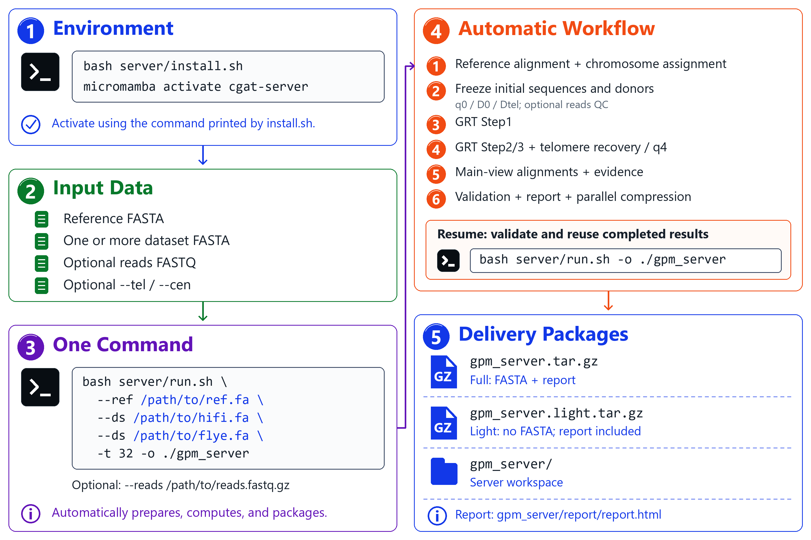

# GPM2.0

**English** | [中文](README_zh.md)

GPM2.0 is a visual assembly tool anchored to a reference genome and designed to integrate the strengths of multiple de novo assembly approaches. It brings outputs from different assembly tools into one unified workflow for import, inspection, and lightweight editing.

## Architecture

GPM2.0 uses a split architecture between the server side and the client side:

- The server side runs alignment commands and generates the delivery zip package in a Linux environment. Upload the `server/` directory to the server before running the workflow.
- The client side imports the server-generated delivery package and provides visualization and lightweight editing. Users can download the platform-specific installer from GitHub Releases; currently supported builds are `win-x86`, `win-arm64`, `mac-x86`, and `mac-arm64`.

## Server-Side Workflow



### Prerequisites

On the Linux server, create the complete `cgat-server` environment once:

```bash
bash server/env.sh
```

The installer reuses `mamba`, `micromamba`, or `conda` when available. If none is installed, it installs micromamba for the current user and creates the environment without `sudo`. It prints the exact commands for the selected manager when finished. For example:

```bash
# Activate
micromamba activate cgat-server

# Deactivate
micromamba deactivate
```

If the installer selects `mamba` or `conda`, replace `micromamba` with the manager name printed by `env.sh`. Re-running `bash server/env.sh` validates the existing managed environment and updates it only when the dependency specification changes.

- Required tools: `SAMtools 1.9+`, `Python 3`, `zip`, `gzip`
- Alignment tools by engine:
  - `minimap2`: recommended `2.31`; older versions that support `-x asm10/asm5`, `-t`, and PAF output remain usable
  - `blastn`: recommended BLAST+ `2.17.0`, with `makeblastdb`
  - `winnowmap`: recommended `2.03`, with `meryl`
- GRT precomputed Final Path: `minimap2`, plus MUMmer4 commands `nucmer`, `delta-filter`, and `show-coords`; `server/env.sh` installs them and makes them available through `PATH` after activation
- Optional reads-based assembly QC: `meryl`, `merqury.sh`, and `craq`; `server/env.sh` installs them, while the workflow invokes them only when one or more `--reads` inputs are provided
- Input data: `ref_genome.fa`, `hifiasm.fa`, `flye.fa`, `canu2.fa`

Note: This document uses these data only as an example to illustrate the workflow. The workflow is not limited to this specific kind of input.

### Run the server preparation script

```bash
bash server/prepare.sh \
  --ref rice_IRGSP_1_0 /path/to/ref.fa \
  --ds hifiasm /path/to/hifi.fa \
  --ds flye /path/to/flye.fa \
  --ds canu2 /path/to/canu2.fa \
  --threads 10
```

The command above is a minimal executable example. Use the option lists below to add optional settings; do not paste the option descriptions into the shell command.

**Common options:**

- `-o/--out`: choose the output directory; default is `./gpm_server` under the current working directory
- `-s/--score`: chr assignment threshold, default `60`
- `--aligner`: choose `minimap2`, `blastn`, or `winnowmap`; default `minimap2`
- `-t/--threads`: alignment worker threads for generated commands, default `10`
- `--tel <motif> <min_repeat>`: repeatable telomere-like tandem-repeat scan rule; for example `--tel TTAGGG 20` marks exact `TTAGGG` repeats of length 20 or higher, including the reverse-complement strand
- `--cen <ref_cen.fa>`: optional complete reference centromere FASTA; each record must be named `<ref_chr_name>_centromere`, for example `Chr01_centromere`
- `--cen-min-len`: minimum centromere alignment length, default `10000`
- `--cen-min-identity`: minimum centromere alignment identity percentage, default `80`
- `--skip-self`: skip same-dataset self alignment; import and cross-dataset Subview remain available, while same-dataset contig-to-contig Subview is unavailable
- The first `--ds` is the locked primary dataset; every later initial `--ds` is a locked support dataset
- Repeatable `--reads`: enable one shared Meryl database and per-dataset Merqury/CRAQ QC; without reads, only reads-based QC is skipped and the complete GRT repair workflow still runs
- `--grt-qc-memory-gb` and `--grt-kmer-size`: tune optional reads QC, defaults `80` and `21`

Do not provide paths for the GRT executables. The workflow automatically calls `minimap2`, `nucmer`, `delta-filter`, and `show-coords` from the active environment; when reads QC is enabled, it also calls `meryl`, `merqury.sh`, and `craq`. Run both `prepare.sh` and the generated `run_all.sh` in an environment whose `PATH` contains the required commands.

> [!IMPORTANT]
> Engine-specific options are optional override knobs. Use them only with the matching `--aligner`; passing an option for another engine fails before output is written.

**minimap2 options, for `--aligner minimap2`:**

- `--minimap-preset`: assembly preset; allowed values are `asm10` and `asm5`, default `asm10`

**blastn options, for `--aligner blastn`:**

- `--blastn-task`: BLAST task; allowed values are `blastn`, `megablast`, and `dc-megablast`, default `blastn`
- `--blastn-evalue`: e-value threshold, default `1e-10`

**winnowmap options, for `--aligner winnowmap`:**

- `--winnowmap-preset`: assembly preset; allowed values are `asm20`, `asm10`, and `asm5`, default `asm20`
- `--winnowmap-kmer`: meryl k-mer size, default `19`
- `--winnowmap-repeat-fraction`: high-frequency k-mer cutoff, default `0.9998`

### Run the complete Server workflow

```bash
bash ./gpm_server/run_all.sh
```

This one command completes the staged computation and automatically creates both delivery archives next to `gpm_server/`:

- `gpm_server.zip`: App full package, including source/reference FASTA and the authoritative q4 FASTA
- `gpm_server.no_fasta.zip`: App no-FASTA package, retaining `.fai`, metadata, Final Path, source-card state, and PAF views

Both archives use the current v2 delivery contract: App workflow `gpm_grt_app_precomputed_v2`, package schema `2`, and Final Path structure schema `1`. v1 and non-GRT packages are rejected and must be regenerated with the current Server scripts.

These are the only delivery archives. There is no separate Server audit zip: the Server workdir is validated before projection, while q0–q3, D0/Dtel, raw evidence FASTA, caches, checkpoints, raw traces, Server scripts, and tool caches stay on the Server side.

No separate packaging command is needed for the initial workflow. If needed, you can instead execute the staged commands printed by `prepare.sh` manually, including the final full-package and light-package commands.

Execution order is strict:

1. finish every `*_vs_ref/result.paf`
2. run `assign_chr_groups.sh`; it also writes the authoritative dataset-track member order to `metadata/track_member_orders.tsv`
3. construct q0 and freeze the ordinary donor set D0 plus the independent telomere donor set Dtel
4. run the two canonical Step1 minimap2 rounds against the same D0
5. run Step2 on q1 vs D0 and Step3 on q2 vs D0 with MUMmer
6. run telomere recovery and finalize q4 plus the traceable Final Path
7. run chromosome-local main-view alignments
8. finalize the Server GRT result and validate the complete Server workdir contract
9. project the App allowlist and atomically create `gpm_server.zip`
10. project the same App contract without FASTA and atomically create `gpm_server.no_fasta.zip`

`run_all.sh` keeps this staged order, stops on program or packaging errors, and resumes computation only from checkpoints whose input, parameter, tool, and output hashes still match. Each packager builds a fresh temporary archive and replaces the final zip only after success, so reruns do not retain removed entries or overwrite a valid archive with a partial result.

### Add one dataset to an existing server project

After the original `gpm_server/` has completed and been delivered, the server can append one new dataset and emit a small add package:

```bash
bash ./gpm_server/add_dataset.sh --ds ds4_name /path/to/ds4.fa
```

By default this writes `gpm_server/add_ds4_name.zip`. To choose a different output path, pass `-o/--out`:

```bash
bash ./gpm_server/add_dataset.sh --ds ds4_name /path/to/ds4.fa -o /path/to/add_ds4_name.zip
```

The generated `add_ds4_name.zip` is an add package, not a full delivery bundle. Use it only with an existing desktop workspace/project: open the existing workspace in GPM2.0, choose the add-package action on the target project row, and select the zip.

An appended dataset does not retroactively join the locked GRT recipe or rewrite the precomputed Final Path. It remains visible in the App and its contigs can be added manually to the editable project path.

The initial workflow and generated add scripts calculate dataset-track contig order on the server. The desktop imports `metadata/track_member_orders.tsv` and does not recalculate that order from anchors. v1 packages and packages produced by older scripts without this file are intentionally unsupported and must be regenerated.

Because the script also merges the new dataset into the server-side `gpm_server/` directory, run the full packager again when you need a fresh full import bundle that already includes the new dataset. Use that full delivery bundle for new desktop workspaces or full re-imports:

```bash
bash ./gpm_server/package_full_zip.sh
```

### Re-package after later Server workspace changes

The initial `run_all.sh` already creates both archives. Use the generated standalone packaging scripts only when you need to rebuild delivery archives after a later Server workspace change such as `add_dataset.sh` or `add_ctg.sh`; both run the executable GRT contract validator before creating a zip:

```bash
# App full package: includes source/reference FASTA and q4 for client-side FASTA export
bash ./gpm_server/package_full_zip.sh

# App no-FASTA package: excludes every .fa/.fasta while keeping .fai, metadata, Final Path, and PAFs
bash ./gpm_server/package_light_no_fasta_zip.sh
```

For delivery packages:

- the full App package carries the partitioned source/reference FASTA referenced by the locator manifests plus `grt/q/q4.fa`; it does not carry Server intermediate GRT artifacts
- the no-FASTA App package excludes every `.fa`/`.fasta` payload, including q4 and partitioned FASTA files, but retains `.fai` and q4 length/hash metadata
- `--skip-self` keeps the same behavior as before: same-dataset Subview is disabled, but import, orientation, and cross-dataset inspection still work

The light delivery bundle can still be imported, inspected, and used for final path PNG/TSV export. The client hides final path FASTA export when FASTA files are unavailable; the All action remains available and exports PNG + TSV only.

### Install and launch GPM2.0

Install the GPM2.0 desktop application on the client machine from the project GitHub Releases page. Choose the installer matching the client platform: Windows x86, Windows ARM64, macOS x86, or macOS ARM64.

### Import the server delivery bundle

Import `gpm_server.zip` into GPM2.0 to start visual inspection and lightweight editing.

The package fixes the primary/support recipe. Creating a project requires only a project name; the App loads the Server-precomputed Final Path and the minimal read-only source-card status needed by the main view. The Final Path header can restore the current chromosome to its immutable Server GRT baseline; project-level edits remain editable and can continue into DEGAP or export workflows. The complete event/evidence/donor/attempt closure is validated before packaging but is not copied into the App delivery archive; App/Tauri does not expose a trace browser. Development builds support only the current v2 GRT delivery contract. v1 and non-GRT packages are rejected and must be regenerated with the current Server scripts.

### Export final path FASTA on the server

When the client imports a light delivery bundle, export the final path `.tsv` from the client first, then move that `.tsv` back to the server where the original FASTA files are still present:

```bash
bash server/export_final_path_fasta.sh \
  --tsv /path/to/project_Chr01_path.tsv \
  --gpm_server ./gpm_server \
  -o /path/to/project_Chr01_path.fa
```

If you are working from the generated `gpm_server/` directory, use its generated helper and omit `--gpm_server`:

```bash
bash ./gpm_server/export_final_path_fasta.sh \
  --tsv /path/to/project_Chr01_path.tsv \
  -o /path/to/project_Chr01_path.fa
```
