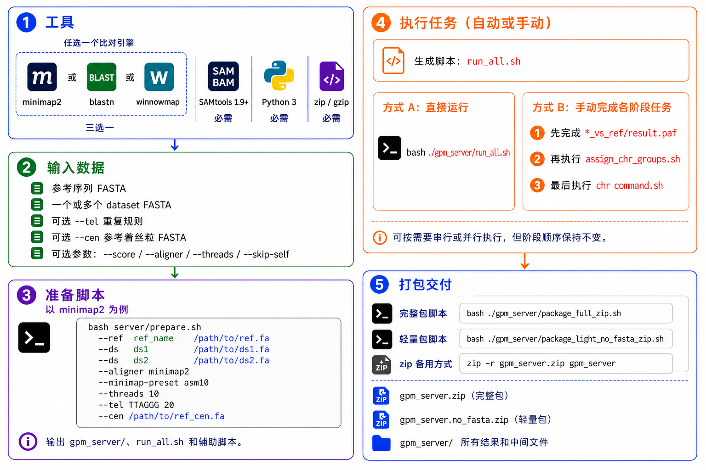

# GPM Next

**中文** | [English](README.md)

GPM Next 是一款以参考基因组为锚点、整合多种 de novo 组装优势的可视化组装工具。它将不同组装工具的结果汇集到统一流程中，便于用户进行导入、浏览与轻量编辑。

## 项目架构

GPM Next 采用服务端与客户端分离的工作模式：

- 服务端在 Linux 环境中执行比对命令并生成 zip 交付包；部署时将 `server/` 目录上传到服务器使用。
- 客户端负责导入服务端生成的交付包，并提供可视化查看与轻量编辑能力。用户可从 GitHub Releases 下载对应平台的安装包，当前支持 `win-x86`、`win-arm64`、`mac-x86`、`mac-arm64` 四个版本。

## 服务端流程



### 环境准备

- 必需工具：`SAMtools 1.9+`、`Python 3`、`zip`、`gzip`
- 各比对引擎工具：
  - `minimap2`：推荐 `2.31`；仍兼容支持 `-x asm10/asm5`、`-t` 和 PAF 输出的旧版本
  - `blastn`：推荐 BLAST+ `2.17.0`，并需要 `makeblastdb`
  - `winnowmap`：推荐 `2.03`，并需要 `meryl`
- 输入数据：`ref_genome.fa`、`hifiasm.fa`、`flye.fa`、`canu2.fa`

注：本文档仅以此类数据为例展示流程，并非仅支持此类输入。

### 执行服务端准备脚本

```bash
bash server/prepare.sh \
  --ref rice_IRGSP_1_0 /path/to/ref.fa \
  --ds hifiasm /path/to/hifi.fa \
  --ds flye /path/to/flye.fa \
  --ds canu2 /path/to/canu2.fa \
  [-o|--out /path/to/gpm_server] \
  [-s|--score 60] \
  [--aligner minimap2|blastn|winnowmap] \
  # minimap2 特有参数，仅在 --aligner minimap2 时使用
  [--minimap-preset asm10|asm5] \
  # blastn 特有参数，仅在 --aligner blastn 时使用
  [--blastn-task blastn|megablast|dc-megablast] \
  [--blastn-evalue 1e-10] \
  # winnowmap 特有参数，仅在 --aligner winnowmap 时使用
  [--winnowmap-preset asm20|asm10|asm5] \
  [--winnowmap-kmer 19] \
  [--winnowmap-repeat-fraction 0.9998] \
  [-t|--threads 10] \
  [--tel TTAGGG 20] \
  [--cen /path/to/ref_cen.fa] \
  [--cen-min-len 10000] \
  [--cen-min-identity 80] \
  [--skip-self]
```

方括号中的参数均为可选项。

**通用参数：**

- `-o/--out`：指定输出目录；不指定时默认写入当前工作目录下的 `./gpm_server`
- `-s/--score`：chr 分配阈值，默认 `60`
- `--aligner`：选择 `minimap2`、`blastn` 或 `winnowmap`；默认 `minimap2`
- `-t/--threads`：生成比对命令时使用的线程数，默认 `10`
- `--tel <motif> <min_repeat>`：可重复指定的端粒样串联重复扫描规则；例如 `--tel TTAGGG 20` 会标记连续 20 次及以上的精确 `TTAGGG` 重复，同时包含反向互补链
- `--cen <ref_cen.fa>`：可选的参考基因组完整着丝粒区域 FASTA；每条记录必须命名为 `<ref_chr_name>_centromere`，例如 `Chr01_centromere`
- `--cen-min-len`：着丝粒比对最小长度，默认 `10000`
- `--cen-min-identity`：着丝粒比对最小一致性百分比，默认 `80`
- `--skip-self`：跳过同一 dataset 的 self alignment；导入、方向矫正和跨 dataset Subview 不受影响，同 dataset 的 ctg-to-ctg Subview 不可用

> [!IMPORTANT]
> 引擎专属参数均为可选覆盖项，只能和对应 `--aligner` 一起使用；若传入与所选引擎不匹配的参数，脚本会在写入输出前失败。

**minimap2 参数，用于 `--aligner minimap2`：**

- `--minimap-preset`：assembly preset；可选 `asm10` 或 `asm5`，默认 `asm10`

**blastn 参数，用于 `--aligner blastn`：**

- `--blastn-task`：BLAST task；可选 `blastn`、`megablast` 或 `dc-megablast`，默认 `blastn`
- `--blastn-evalue`：e-value 阈值，默认 `1e-10`

**winnowmap 参数，用于 `--aligner winnowmap`：**

- `--winnowmap-preset`：assembly preset；可选 `asm20`、`asm10` 或 `asm5`，默认 `asm20`
- `--winnowmap-kmer`：meryl k-mer 大小，默认 `19`
- `--winnowmap-repeat-fraction`：高频 k-mer 阈值，默认 `0.9998`

### 执行批量比对任务

```bash
bash ./gpm_server/run_all.sh
```

如有需要，也可以根据脚本打印的命令自行安排执行方式，例如串行或并行。

执行顺序必须固定：

1. 先完成所有 `*_vs_ref/result.paf`
2. 再执行 `assign_chr_groups.sh`
3. 最后执行每个 `runs/chr_<chr>/command.sh`

因此 `run_all.sh` 会按这个阶段顺序组织命令。

### 向已有服务端项目追加一个 dataset

初始 `gpm_server/` 完成比对并交付后，可以在服务端追加一个新 dataset，并生成一个小型增量包：

```bash
bash ./gpm_server/add_dataset.sh --ds ds4_name /path/to/ds4.fa
```

默认输出为 `gpm_server/add_ds4_name.zip`。如需指定输出路径，使用 `-o/--out`：

```bash
bash ./gpm_server/add_dataset.sh --ds ds4_name /path/to/ds4.fa -o /path/to/add_ds4_name.zip
```

生成的 `add_ds4_name.zip` 是追加包，不是完整交付包；它只用于应用到已有桌面端工作区/项目。请先在 GPM Next 打开已有项目区，再在目标项目行上选择导入追加包并选中该 zip。

由于脚本也会把新 dataset 合并回服务端 `gpm_server/` 目录，如需得到已经包含新 dataset 的完整包，请重新运行完整打包脚本。该完整 zip 可用于创建新的桌面端项目区或执行完整重新导入：

```bash
bash ./gpm_server/package_full_zip.sh
```

### 打包服务端交付文件

```bash
zip -r gpm_server.zip gpm_server
```

也可以直接运行准备脚本生成的打包脚本：

```bash
# 完整交付包：包含 .fa/.fasta，可在客户端导出 final path FASTA
bash ./gpm_server/package_full_zip.sh

# 轻量交付包：排除 .fa/.fasta，仅保留 .fai、metadata 与 runs
bash ./gpm_server/package_light_no_fasta_zip.sh
```

对于交付包：

- 完整 zip 会去掉原始单体 FASTA，只保留 locator 清单所指向的 partitioned FASTA 载荷
- 轻量 zip 会排除所有 `.fa`/`.fasta`，包括 partitioned FASTA
- `--skip-self` 的行为保持不变：同 dataset 的 Subview 关闭，但导入、方向矫正、跨 dataset 浏览仍然可用

轻量交付包可正常导入、浏览与导出 final path PNG/TSV；客户端会隐藏 final path FASTA 导出入口，All 导出仍可使用，但只导出 PNG + TSV。

### 安装并打开 GPM Next

在客户端设备安装 GPM Next。请从 GitHub Releases 下载与当前平台匹配的安装包。

### 导入服务端交付包

将服务端生成的 `gpm_server.zip` 导入 GPM Next，即可进入可视化浏览与轻量编辑流程。

### 在服务器端导出 final path FASTA

如果客户端导入的是轻量交付包，先在客户端导出 final path `.tsv`，再把 `.tsv` 放回仍保留原始 FASTA 的服务器，执行：

```bash
bash server/export_final_path_fasta.sh \
  --tsv /path/to/project_Chr01_path.tsv \
  --gpm_server ./gpm_server \
  -o /path/to/project_Chr01_path.fa
```

如果从生成后的 `gpm_server/` 目录使用，也可以调用生成脚本并省略 `--gpm_server`：

```bash
bash ./gpm_server/export_final_path_fasta.sh \
  --tsv /path/to/project_Chr01_path.tsv \
  -o /path/to/project_Chr01_path.fa
```
