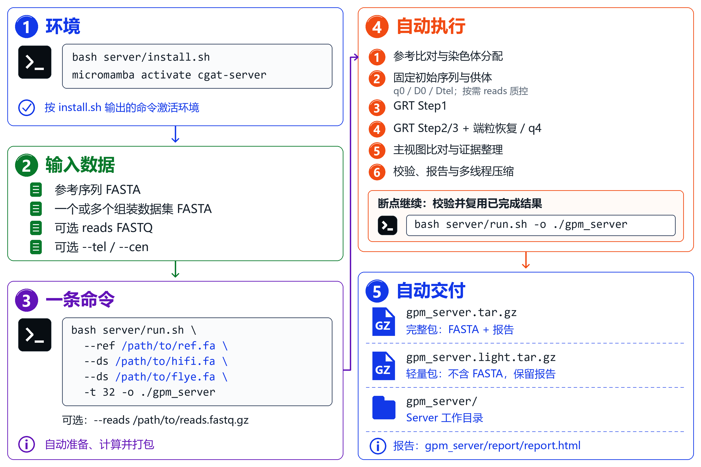

# GPM2.0

**中文** | [English](README.md)

GPM2.0 是一款以参考基因组为锚点、整合多种 de novo 组装优势的可视化组装工具。它将不同组装工具的结果汇集到统一流程中，便于用户进行导入、浏览与轻量编辑。

## 项目架构

GPM2.0 采用服务端与客户端分离的工作模式：

- 服务端在 Linux 环境中执行比对命令并生成 zip 交付包；部署时将 `server/` 目录上传到服务器使用。
- 客户端负责导入服务端生成的交付包，并提供可视化查看与轻量编辑能力。用户可从 GitHub Releases 下载对应平台的安装包，当前支持 `win-x86`、`win-arm64`、`mac-x86`、`mac-arm64` 四个版本。

## 服务端流程



### 环境准备

首次在 Linux Server 上创建完整的 `cgat-server` 环境：

```bash
bash server/env.sh
```

安装脚本会复用已有的 `mamba`、`micromamba` 或 `conda`；三者都不存在时，会为当前用户无 sudo 安装 micromamba 并创建环境。完成后脚本会根据实际采用的 manager 打印准确命令。例如：

```bash
# 激活
micromamba activate cgat-server

# 退出
micromamba deactivate
```

如果脚本选择的是 `mamba` 或 `conda`，把示例中的 `micromamba` 换成 `env.sh` 打印的 manager 名称。再次运行 `bash server/env.sh` 会校验已托管的环境，只在依赖配置变化时更新。

- 必需工具：`SAMtools 1.9+`、`Python 3`、`zip`、`gzip`
- 各比对引擎工具：
  - `minimap2`：推荐 `2.31`；仍兼容支持 `-x asm10/asm5`、`-t` 和 PAF 输出的旧版本
  - `blastn`：推荐 BLAST+ `2.17.0`，并需要 `makeblastdb`
  - `winnowmap`：推荐 `2.03`，并需要 `meryl`
- GRT 预计算 Final Path：`minimap2`，以及 MUMmer4 的 `nucmer`、`delta-filter`、`show-coords`；`server/env.sh` 会安装这些工具，激活环境后即可通过 `PATH` 调用
- 可选 reads 组装质控：`meryl`、`merqury.sh`、`craq`；`server/env.sh` 会统一安装，但流程仅在传入一个或多个 `--reads` 时调用
- 输入数据：`ref_genome.fa`、`hifiasm.fa`、`flye.fa`、`canu2.fa`

注：本文档仅以此类数据为例展示流程，并非仅支持此类输入。

### 执行服务端准备脚本

```bash
bash server/prepare.sh \
  --ref rice_IRGSP_1_0 /path/to/ref.fa \
  --ds hifiasm /path/to/hifi.fa \
  --ds flye /path/to/flye.fa \
  --ds canu2 /path/to/canu2.fa \
  [-o|--out /path/to/gpm_server] \
  [-s|--score 60] \
  [--aligner minimap2|blastn|winnowmap] \
  # minimap2 特有参数，仅在 --aligner minimap2 时使用
  [--minimap-preset asm10|asm5] \
  # blastn 特有参数，仅在 --aligner blastn 时使用
  [--blastn-task blastn|megablast|dc-megablast] \
  [--blastn-evalue 1e-10] \
  # winnowmap 特有参数，仅在 --aligner winnowmap 时使用
  [--winnowmap-preset asm20|asm10|asm5] \
  [--winnowmap-kmer 19] \
  [--winnowmap-repeat-fraction 0.9998] \
  [-t|--threads 10] \
  [--tel TTAGGG 20] \
  [--cen /path/to/ref_cen.fa] \
  [--cen-min-len 10000] \
  [--cen-min-identity 80] \
  [--reads /path/to/reads.fastq.gz ...] \
  [--grt-qc-memory-gb 80] \
  [--grt-kmer-size 21] \
  [--skip-self]
```

方括号中的参数均为可选项。

**通用参数：**

- `-o/--out`：指定输出目录；不指定时默认写入当前工作目录下的 `./gpm_server`
- `-s/--score`：chr 分配阈值，默认 `60`
- `--aligner`：选择 `minimap2`、`blastn` 或 `winnowmap`；默认 `minimap2`
- `-t/--threads`：生成比对命令时使用的线程数，默认 `10`
- `--tel <motif> <min_repeat>`：可重复指定的端粒样串联重复扫描规则；例如 `--tel TTAGGG 20` 会标记连续 20 次及以上的精确 `TTAGGG` 重复，同时包含反向互补链
- `--cen <ref_cen.fa>`：可选的参考基因组完整着丝粒区域 FASTA；每条记录必须命名为 `<ref_chr_name>_centromere`，例如 `Chr01_centromere`
- `--cen-min-len`：着丝粒比对最小长度，默认 `10000`
- `--cen-min-identity`：着丝粒比对最小一致性百分比，默认 `80`
- `--skip-self`：跳过同一 dataset 的 self alignment；导入、方向矫正和跨 dataset Subview 不受影响，同 dataset 的 ctg-to-ctg Subview 不可用
- 第一个 `--ds` 固定为 primary，后续所有初始 `--ds` 固定为 support
- 可重复的 `--reads`：启用一个共享 Meryl 数据库和逐 dataset Merqury/CRAQ 质控；不传 reads 时只跳过 reads 质控，完整 GRT 修复流程仍会执行
- `--grt-qc-memory-gb` 与 `--grt-kmer-size`：调整可选 reads 质控，默认值分别为 `80` 和 `21`

无需提供 GRT 工具路径。流程会自动从当前环境调用 `minimap2`、`nucmer`、`delta-filter`、`show-coords`；启用 reads 质控时还会调用 `meryl`、`merqury.sh`、`craq`。请确保执行 `prepare.sh` 和随后生成的 `run_all.sh` 时，所用环境的 `PATH` 均能找到相应命令。

> [!IMPORTANT]
> 引擎专属参数均为可选覆盖项，只能和对应 `--aligner` 一起使用；若传入与所选引擎不匹配的参数，脚本会在写入输出前失败。

**minimap2 参数，用于 `--aligner minimap2`：**

- `--minimap-preset`：assembly preset；可选 `asm10` 或 `asm5`，默认 `asm10`

**blastn 参数，用于 `--aligner blastn`：**

- `--blastn-task`：BLAST task；可选 `blastn`、`megablast` 或 `dc-megablast`，默认 `blastn`
- `--blastn-evalue`：e-value 阈值，默认 `1e-10`

**winnowmap 参数，用于 `--aligner winnowmap`：**

- `--winnowmap-preset`：assembly preset；可选 `asm20`、`asm10` 或 `asm5`，默认 `asm20`
- `--winnowmap-kmer`：meryl k-mer 大小，默认 `19`
- `--winnowmap-repeat-fraction`：高频 k-mer 阈值，默认 `0.9998`

### 执行完整 Server 流程

```bash
bash ./gpm_server/run_all.sh
```

这一条命令会完成全部分阶段计算，并在 `gpm_server/` 同级目录自动生成两个交付包：

- `gpm_server.zip`：App 完整包，包含 source/reference FASTA 与权威 q4 FASTA
- `gpm_server.no_fasta.zip`：App no-FASTA 包，保留 `.fai`、metadata、Final Path、source-card 状态和 PAF 视图

最终只交付这两个 zip，不再额外提供 Server 审计包。Server 工作目录会在投影前完成完整校验；q0–q3、D0/Dtel、raw evidence FASTA、cache、checkpoint、原始 trace、Server 脚本和工具缓存均留在 Server 侧，不进入 App 交付包。

初始流程无需再单独执行打包命令。如需手工安排阶段，也可以依次执行 `prepare.sh` 打印的命令，但必须包含最后的完整包与轻量包命令。

执行顺序必须固定：

1. 先完成所有 `*_vs_ref/result.paf`
2. 执行 `assign_chr_groups.sh`；该脚本同时把 dataset 轨道的权威成员顺序写入 `metadata/track_member_orders.tsv`
3. 构建 q0，并冻结普通 donor 集合 D0 和独立端粒 donor 集合 Dtel
4. 对同一 D0 运行两轮规范 Step1 minimap2
5. 用 MUMmer 执行 q1 vs D0 的 Step2 和 q2 vs D0 的 Step3
6. 执行端粒恢复并生成 q4 与可追溯 Final Path
7. 执行染色体局部主视图比对
8. 完成 Server GRT 结果并校验完整 Server 工作目录契约
9. 投影 App allowlist 并原子生成 `gpm_server.zip`
10. 投影同一 App 契约的无 FASTA 版本并原子生成 `gpm_server.no_fasta.zip`

`run_all.sh` 会严格保持该顺序，遇到程序或打包错误立即停止，并且只复用输入、参数、工具和输出 hash 均仍匹配的计算检查点。每个打包脚本都会先生成全新的临时 zip，成功后才替换最终文件，因此重跑不会保留已经删除的旧条目，也不会用失败的半成品覆盖有效交付包。

### 向已有服务端项目追加一个 dataset

初始 `gpm_server/` 完成比对并交付后，可以在服务端追加一个新 dataset，并生成一个小型增量包：

```bash
bash ./gpm_server/add_dataset.sh --ds ds4_name /path/to/ds4.fa
```

默认输出为 `gpm_server/add_ds4_name.zip`。如需指定输出路径，使用 `-o/--out`：

```bash
bash ./gpm_server/add_dataset.sh --ds ds4_name /path/to/ds4.fa -o /path/to/add_ds4_name.zip
```

生成的 `add_ds4_name.zip` 是追加包，不是完整交付包；它只用于应用到已有桌面端工作区/项目。请先在 GPM2.0 打开已有项目区，再在目标项目行上选择导入追加包并选中该 zip。

追加 dataset 不会追溯加入已锁定的 GRT recipe，也不会改写预计算 Final Path；它仍可在 App 中展示，并允许用户把其中的 contig 手工加入项目可编辑路径。

初始流程和生成的追加脚本都会在服务端计算 dataset 轨道的 ctg 顺序。桌面端只导入 `metadata/track_member_orders.tsv`，不会再根据 anchor 重算顺序。旧脚本生成且缺少该文件的包不再兼容，需要使用当前服务端脚本重新生成。

由于脚本也会把新 dataset 合并回服务端 `gpm_server/` 目录，如需得到已经包含新 dataset 的完整包，请重新运行完整打包脚本。该完整 zip 可用于创建新的桌面端项目区或执行完整重新导入：

```bash
bash ./gpm_server/package_full_zip.sh
```

### Server 工作目录后续变化后的重新打包

初始 `run_all.sh` 已经自动生成两种交付包。只有在后续执行 `add_dataset.sh`、`add_ctg.sh` 等操作并需要重建交付包时，才需要使用生成的独立打包脚本；两种脚本都会在创建 zip 前执行 GRT 可执行契约校验器：

```bash
# App 完整包：包含 source/reference FASTA 与 q4，可在客户端导出 FASTA
bash ./gpm_server/package_full_zip.sh

# App no-FASTA 包：排除所有 .fa/.fasta，保留 .fai、metadata、Final Path 与 PAF
bash ./gpm_server/package_light_no_fasta_zip.sh
```

对于交付包：

- 完整 App zip 只携带 locator 清单所指向的 partitioned source/reference FASTA、q4 以及 App 所需元数据，不携带 Server GRT 中间产物
- no-FASTA zip 会排除所有 `.fa`/`.fasta`，包括 q4 和 partitioned FASTA，但保留 `.fai` 及 q4 长度/hash 元数据
- `--skip-self` 的行为保持不变：同 dataset 的 Subview 关闭，但导入、方向矫正、跨 dataset 浏览仍然可用

轻量交付包可正常导入、浏览与导出 final path PNG/TSV；客户端会隐藏 final path FASTA 导出入口，All 导出仍可使用，但只导出 PNG + TSV。

### 安装并打开 GPM2.0

在客户端设备安装 GPM2.0。请从 GitHub Releases 下载与当前平台匹配的安装包。

### 导入服务端交付包

将服务端生成的 `gpm_server.zip` 导入 GPM2.0，即可进入可视化浏览与轻量编辑流程。

交付包已经固定 primary/support recipe。建项目只需输入项目名；App 直接载入 Server 预计算的 Final Path 和主视图所需的最小只读 source-card 状态。Final Path 标题栏可将当前 chromosome 恢复为不可变的 Server GRT baseline；项目级 Final Path 仍可编辑，并可继续进入 DEGAP 或导出流程。完整 event/evidence/donor/attempt 闭包会在打包前校验，但不会复制进 App 交付 zip；App/Tauri 不再暴露 trace 浏览器。旧的非 GRT 包明确不兼容。

### 在服务器端导出 final path FASTA

如果客户端导入的是轻量交付包，先在客户端导出 final path `.tsv`，再把 `.tsv` 放回仍保留原始 FASTA 的服务器，执行：

```bash
bash server/export_final_path_fasta.sh \
  --tsv /path/to/project_Chr01_path.tsv \
  --gpm_server ./gpm_server \
  -o /path/to/project_Chr01_path.fa
```

如果从生成后的 `gpm_server/` 目录使用，也可以调用生成脚本并省略 `--gpm_server`：

```bash
bash ./gpm_server/export_final_path_fasta.sh \
  --tsv /path/to/project_Chr01_path.tsv \
  -o /path/to/project_Chr01_path.fa
```
